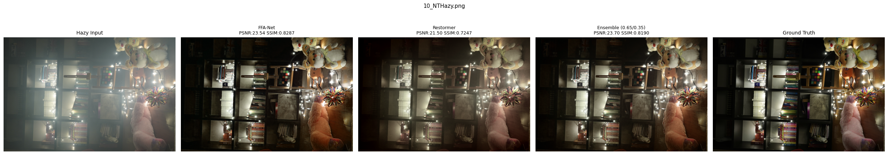

# 🌙 Nighttime Image Dehazing — NTIRE 2026

[]()
[]()
[](LICENSE)

A deep-learning approach for **nighttime image dehazing**, built for the **NTIRE 2026 Night Time Image Dehazing Challenge**. The project restores clear nighttime images affected by haze, glow, non-uniform illumination, color distortion, and sensor noise. The primary model is **FFA-Net (Feature Fusion Attention Network)**, fine-tuned from pretrained indoor-dehazing weights, with a secondary Restormer baseline and a simple weighted ensemble of the two.

---

## Table of Contents

- [Problem](#-problem)
- [Challenge](#-ntire-2026-challenge)
- [Method](#-method)
- [Training Pipeline](#-training-pipeline)
- [Loss Function](#-loss-function)
- [Evaluation Metrics](#-evaluation-metrics)
- [Qualitative Results](#️-qualitative-results)
- [Ensemble](#-ensemble)
- [Installation](#-installation)
- [Dataset Structure](#-dataset-structure)
- [Training](#️-training)
- [Checkpoints](#-checkpoints)
- [Limitations](#-current-limitations)
- [Project Structure](#-project-structure)
- [Team](#-team)
- [References](#-references)

---

## 📌 Problem

Nighttime dehazing is harder than daytime dehazing because nighttime scenes contain:

* 🌫️ Non-uniform haze and atmospheric scattering
* 💡 Strong glow and halos around light sources
* 🌑 Extremely dark regions and low signal-to-noise ratios
* 🎨 Color casts from low-light imaging
* 🔆 Coexisting overexposed and underexposed regions
* 📷 Significant sensor noise

These challenges matter for autonomous driving, surveillance, intelligent transportation, and downstream computer-vision tasks.

---

## 🏆 NTIRE 2026 Challenge

The challenge uses a small real-world paired nighttime dataset designed to test generalization.

| Split      | Description                                |
| ---------- | ------------------------------------------- |
| Training   | 25 paired high-resolution nighttime images |
| Validation | 5 paired images                            |
| Test       | 5 hidden images                         |
| Evaluation | PSNR, SSIM, LPIPS                          |

Because the dataset is small, the project relies on patch-based training and heavy augmentation to increase effective training data. See `factsheetntire.pdf` for the full challenge specification.

---

## 🧠 Method

### FFA-Net

The main restoration network is **FFA-Net — Feature Fusion Attention Network**, implemented in `train.py`:

* 3 groups × 19 blocks per group (paper configuration)
* 64 feature channels
* Channel Attention (CA) + Pixel Attention (PA) per block
* Local residual connections (per block and per group)
* Global residual learning
* Attention-based fusion of the three group outputs


Each block combines convolutional feature extraction with channel and pixel attention, letting the network focus on the regions that matter most in challenging nighttime scenes (glow, dark shadows, noisy patches).

### Restormer baseline

A Restormer U-Net variant is used as a secondary model for comparison and ensembling.


---

## 🔄 Training Pipeline

```text
Hazy / GT pairs → load into RAM → random 256×256 crop
    → augmentation (h-flip, v-flip, random 90° rotation)
    → FFA-Net → Charbonnier loss → backprop
    → Adam + warmup/cosine LR → full-image validation every 5 epochs
```

| Parameter              |        Value |
| ----------------------- | -----------: |
| Patch size              |    256 × 256 |
| Repeats per image/epoch |           50 |
| Batch size              |            4 |
| Epochs                  |           60 |
| Initial learning rate   |     5 × 10⁻⁵ |
| Warm-up                 |     3 epochs |
| Optimizer               |         Adam |
| Loss                    |  Charbonnier |
| Gradient clipping       |          1.0 |
| Mixed precision         |     CUDA AMP |
| Multi-GPU               | DataParallel |

All settings are defined at the top of `train.py`.

---

## 🎯 Loss Function

**Charbonnier Loss** (ε = 1e-6):

```text
L(x, y) = mean( √((x - y)² + ε) )
```

A robust, differentiable approximation of L1 used as the pixel-level reconstruction objective. The challenge factsheet also recommends combining a strong pixel loss (L1/Charbonnier) with structural, perceptual (LPIPS), color, and nighttime-specific losses to balance PSNR, SSIM, and LPIPS jointly — this is not yet implemented (see [Limitations](#-current-limitations)).

---

## 📊 Evaluation Metrics

| Metric | Direction | Notes |
| ------ | :-------: | ----- |
| **PSNR** | ↑ higher is better | Pixel-level fidelity. `<15 dB` very poor · `15–20` poor · `20–25` acceptable · `25–30` good · `>30` excellent |
| **SSIM** | ↑ higher is better | Structural similarity (luminance, contrast, local structure). `>0.85` considered excellent |
| **LPIPS** | ↓ lower is better | Learned-feature perceptual distance; catches artifacts and color/texture issues pixel metrics miss |

---

## 🖼️ Qualitative Results

Example comparison on `10_NTHazy.png`:

| Method                 |         PSNR |       SSIM |
| ---------------------- | -----------: | ---------: |
| FFA-Net                | **23.54 dB** | **0.8287** |
| Restormer              |     21.50 dB |     0.7247 |
| Ensemble (0.65 / 0.35) | **23.70 dB** |     0.8190 |



FFA-Net produces a substantially clearer image than the hazy input while preserving nighttime illumination and scene structure. The ensemble edges out the highest PSNR on this example; FFA-Net alone has the highest SSIM among the individual models.

> **Note:** These numbers are from a single displayed example, not the overall test-set score.

---

## ⚖️ Ensemble

```text
Ensemble = 0.65 × FFA-Net + 0.35 × Restormer
```

For the example above: PSNR 23.70 dB, SSIM 0.8190. The ensemble is a simple way to combine the complementary restoration behavior of the two architectures without retraining.

---

## 🚀 Pretrained Weights

FFA-Net initializes from pretrained **ITS indoor dehazing weights** (`its_train_ffa_3_19.pk`):

```python
PRETRAINED = "/kaggle/input/ffa-pretrained/its_train_ffa_3_19.pk"  # edit to your path
```

Download from the official FFA-Net weights (Google Drive folder linked at the top of `train.py`). If the file isn't found at that path, the script prints a warning and trains from scratch instead of failing.

---

## 💻 Installation

```bash
git clone https://github.com/ashvp/Dehazing---NTIRE-2026.git
cd "Dehazing---NTIRE-2026"

pip install torch torchvision
pip install numpy pillow matplotlib tqdm scikit-image
```

`train.py` was written for Kaggle notebooks (paths default to `/kaggle/input/...` and `/kaggle/working/...`). To run elsewhere, update `TRAIN_DIR`, `GT_DIR`, `SAVE_DIR`, and `PRETRAINED` at the top of the script, and ensure a CUDA GPU is available (the script hardcodes `device = "cuda"`).

---

## 📁 Dataset Structure

```text
dataset/
├── train/
│   ├── 01_NTHazy.png
│   ├── 02_NTHazy.png
│   └── ...
└── gt/
    ├── 01_GT.png
    ├── 02_GT.png
    └── ...
```

Pairing convention: `<name>_NTHazy.png` ↔ `<name>_GT.png` (e.g. `10_NTHazy.png` → `10_GT.png`).

---

## 🏋️ Training

Edit the paths at the top of `train.py`:

```python
TRAIN_DIR  = "/path/to/train"
GT_DIR     = "/path/to/gt"
SAVE_DIR   = "/path/to/checkpoints"
PRETRAINED = "/path/to/its_train_ffa_3_19.pk"
```

Then:

```bash
python train.py
```

What it does:

1. Loads all paired images into RAM.
2. Generates random 256×256 crops (50 repeats/image/epoch).
3. Applies random flips and 90° rotations.
4. Fine-tunes FFA-Net with Charbonnier loss, Adam, and a warmup + cosine LR schedule.
5. Trains with CUDA mixed precision and gradient clipping.
6. Runs full-image validation every 5 epochs (PSNR + SSIM).
7. Saves the best checkpoint by validation PSNR and per-epoch checkpoints (`.pth` + `.zip`).
8. Plots hazy / GT / prediction comparisons every 5 epochs.

---

## 💾 Checkpoints

```text
checkpoints_ffa/
├── ffa_best.pth          # best model by validation PSNR
├── ffa_epoch_1.pth  / .zip
├── ffa_epoch_2.pth  / .zip
└── ...
```

---

## 🔬 Current Limitations

**1. Small dataset.** Only 25 real paired training images — overfitting is a real risk despite patch-based augmentation.

**2. Loss is pixel-only.** Currently just Charbonnier. Not yet included: SSIM loss, LPIPS/perceptual loss, color consistency loss, brightness realism loss, frequency/wavelet loss — all suggested directions from the challenge factsheet.

**3. Validation uses the training set.** `train.py` builds `val_files` from `TRAIN_DIR`:

```python
val_files = sorted(os.listdir(TRAIN_DIR))
```

So "validation" currently evaluates full images from the training directory, not a held-out split. Point `TRAIN_DIR`/`GT_DIR` at a genuinely separate validation directory (or add a dedicated `VAL_DIR`/`VAL_GT_DIR`) for a trustworthy PSNR/SSIM curve.

---

## 📚 Project Structure

```text
Dehazing---NTIRE-2026/
├── train.py
├── README.md
├── LICENSE
├── factsheetntire.pdf
├── FFA-Net pipeline.png
├── Attention Layer.png
├── Restormer U-NET.png
├── ensemble.png
├── dataset/
│   ├── train/
│   └── gt/
└── checkpoints_ffa/
    └── ffa_best.pth
```

---

## 👥 Team

**NTIRE 2026 Nighttime Image Dehazing Challenge**

- Ashwin V
- Madhu Shraya
- Aditya Kumar

---

## 📖 References

* NTIRE 2026 Night Time Image Dehazing Challenge — project specification and evaluation framework (`factsheetntire.pdf`).
* Qin, X. et al., *FFA-Net: Feature Fusion Attention Network for Single Image Dehazing*, AAAI 2020.
* Zamir, S. W. et al., *Restormer: Efficient Transformer for High-Resolution Image Restoration*, CVPR 2022.

---

## ⭐ Key Takeaway

Attention-based nighttime dehazing with FFA-Net, using patch-based training, augmentation, pretrained ITS initialization, mixed-precision optimization, and PSNR/SSIM evaluation — plus a Restormer baseline and a weighted ensemble. The initial experiments show FFA-Net meaningfully improving visibility in nighttime hazy scenes while preserving scene structure and realistic illumination.
